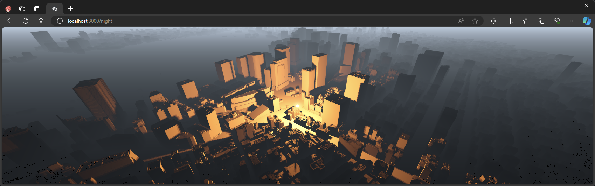
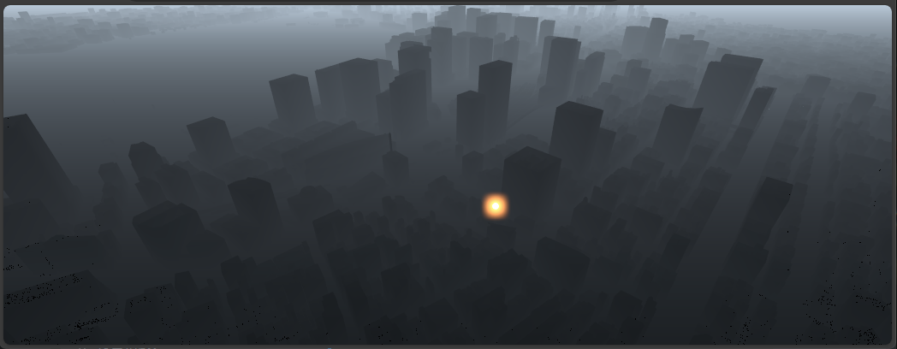

# Practice - Three.js



## Deploy

- [https://kem198.github.io/practice-threejs/](https://kem198.github.io/practice-threejs/)
  - Official
    - three.js docs (deploy on Vercel)
  - PLATEAU
    - tpc12-1
    - PLATEAUtpc12-2 (deploy on Vercel)
  - ユニティちゃん

## Reference / Copyright

### Common

- [mrdoob/three.js: JavaScript 3D Library.](https://github.com/mrdoob/three.js/)

### PLATEAU

#### tpc12-1

- [TOPIC 12｜Three.jsで活用する\[1/2\]｜Three.jsを使った3D都市モデルの読み込みと表示 \| How To Use \| PLATEAU \[プラトー\]](https://www.mlit.go.jp/plateau/learning/tpc12-1/)
- [一般社団法人　社会基盤情報流通推進協議会$都市局$3D都市モデル（Project PLATEAU）東京都23区$FBX](https://www.geospatial.jp/ckan/dataset/plateau-tokyo23ku/resource/04a3109d-9392-42e9-95d2-e04bda7a8d42)

#### tpc12-2

- [TOPIC 12｜Three.jsで活用する\[2/2\]｜ReactでThree.jsを扱う \| How To Use \| PLATEAU \[プラトー\]](https://www.mlit.go.jp/plateau/learning/tpc12-2/)
- [Project-PLATEAU/plateau-streaming-tutorial: PLATEAU配信サービス利用のためのチュートリアル](https://github.com/Project-PLATEAU/plateau-streaming-tutorial)
- [\[Three.js\] r155からライトの光度単位が変わりました \#JavaScript - Qiita](https://qiita.com/masato_makino/items/0de9657633e44e91494a)

### ユニティちゃん

- [UNITY-CHAN! OFFICIAL WEBSITE](https://unity-chan.com/) (© Unity Technologies Japan/UCL)
- [Unity glTFast Documentation \| Unity glTFast \| 6.0.1](https://docs.unity3d.com/Packages/com.unity.cloud.gltfast@6.0/manual/index.html)
    - [Installation \| Unity glTFast \| 6.1.0](https://docs.unity3d.com/Packages/com.unity.cloud.gltfast@6.1/manual/installation.html)
- [Unityでユニティちゃんがピンクになるのを解決する-14にゴー](https://blog.14nigo.net/2023/03/fixpinkunitychan.html)

## Memo

### (2024-05-12) PLATEAU tpc12-2 の依存関係エラーについて

[TOPIC 12｜Three.jsで活用する\[2/2\]｜ReactでThree.jsを扱う \| How To Use \| PLATEAU \[プラトー\]](https://www.mlit.go.jp/plateau/learning/tpc12-2/) > 「■ インタラクションの追加」を実施しようとしたところ、次のエラーが発生した。

```shell
# 開発用サーバー起動
# この状態で http://localhost:3000/night にアクセスすると次のエラーが表示され描画に失敗する
$ npm run dev

> dev
> next dev

ready - started server on 0.0.0.0:3000, url: http://localhost:3000
event - compiled client and server successfully in 941 ms (159 modules)
wait  - compiling / (client and server)...
event - compiled client and server successfully in 183 ms (217 modules)
wait  - compiling /_error (client and server)...
event - compiled client and server successfully in 41 ms (218 modules)
wait  - compiling /basic...
event - compiled client and server successfully in 3s (905 modules)
wait  - compiling /night...
error - ./src/AppNight.tsx:4:0
Module not found: Can't resolve 'postprocessing'
  2 | import { Canvas } from "@react-three/fiber";
  3 | import { Bloom, EffectComposer, SSAO } from "@react-three/postprocessing";
> 4 | import { BlendFunction } from "postprocessing";
  5 | import React from "react";
  6 |
  7 | import { Illuminator } from "../src/Illuminator";

Import trace for requested module:
./pages/night.tsx

https://nextjs.org/docs/messages/module-not-found
```

`npm install` をすると、@react-three/postprocessing について依存関係の警告が発生し、インストールできていないようだった。

```shell
$ npm install
npm warn ERESOLVE overriding peer dependency
npm warn While resolving: @monogrid/gainmap-js@3.0.5
npm warn Found: three@0.142.0
npm warn node_modules/three
npm warn   three@"^0.142.0" from the root project
npm warn   11 more (@react-spring/three, @react-three/drei, ...)
npm warn
npm warn Could not resolve dependency:
npm warn peer three@">= 0.159.0" from @monogrid/gainmap-js@3.0.5
npm warn node_modules/@react-three/drei/node_modules/@monogrid/gainmap-js
npm warn   @monogrid/gainmap-js@"^3.0.5" from @react-three/drei@9.105.6
npm warn   node_modules/@react-three/drei
npm warn
npm warn Conflicting peer dependency: three@0.164.1
npm warn node_modules/three
npm warn   peer three@">= 0.159.0" from @monogrid/gainmap-js@3.0.5
npm warn   node_modules/@react-three/drei/node_modules/@monogrid/gainmap-js
npm warn     @monogrid/gainmap-js@"^3.0.5" from @react-three/drei@9.105.6
npm warn     node_modules/@react-three/drei
npm warn ERESOLVE overriding peer dependency
npm warn While resolving: maath@0.10.7
npm warn Found: three@0.142.0

# ... (略) ... この後もたくさん出ている
```

この依存関係エラーは結論 Three.js のバージョンを 0.154.* 系にすると解消した。

```shell
$ git diff package.json
diff --git a/docs/plateau/tpc12-2/package.json b/docs/plateau/tpc12-2/package.json
index 8f67cec..63367ed 100644
--- a/docs/plateau/tpc12-2/package.json
+++ b/docs/plateau/tpc12-2/package.json
@@ -22,7 +22,7 @@
     "next": "^12.3.1",
     "react": "^18.2.0",
     "react-dom": "^18.2.0",
-    "three": "^0.142.0",
+    "three": "^0.154.0", # バージョンを ^0.154.0 で指定
     "three-stdlib": "^2.12.1"
   },
   "devDependencies": {

# @react-three/postprocessing に関する警告が解消された
# まだ別のパッケージの警告が出ているが、とりあえずよしとする。
$ npm install
npm warn ERESOLVE overriding peer dependency
npm warn While resolving: @monogrid/gainmap-js@3.0.5
npm warn Found: three@0.154.0
npm warn node_modules/three
npm warn   three@"^0.154.0" from the root project
npm warn   14 more (@react-spring/three, @react-three/drei, maath, ...)
npm warn
npm warn Could not resolve dependency:
npm warn peer three@">= 0.159.0" from @monogrid/gainmap-js@3.0.5
npm warn node_modules/@react-three/drei/node_modules/@monogrid/gainmap-js
npm warn   @monogrid/gainmap-js@"^3.0.5" from @react-three/drei@9.105.6
npm warn   node_modules/@react-three/drei
npm warn
npm warn Conflicting peer dependency: three@0.164.1
npm warn node_modules/three
npm warn   peer three@">= 0.159.0" from @monogrid/gainmap-js@3.0.5
npm warn   node_modules/@react-three/drei/node_modules/@monogrid/gainmap-js
npm warn     @monogrid/gainmap-js@"^3.0.5" from @react-three/drei@9.105.6
npm warn     node_modules/@react-three/drei

added 1 package, and audited 197 packages in 1s

19 packages are looking for funding
  run `npm fund` for details

2 moderate severity vulnerabilities

To address all issues (including breaking changes), run:
  npm audit fix --force

Run `npm audit` for details.

# 開発サーバーを起動して  http://localhost:3000/night へ遷移
# 問題なく描画された
$ npm run dev

> dev
> next dev

ready - started server on 0.0.0.0:3000, url: http://localhost:3000
event - compiled client and server successfully in 1360 ms (159 modules)
wait  - compiling /night (client and server)...
event - compiled client and server successfully in 3.6s (857 modules)
wait  - compiling /_error (client and server)...
event - compiled client and server successfully in 105 ms (858 modules)
```

### (2024-05-12) PLATEAU tpc12-2 の光度について

前述の依存関係について調べている間起こった内容のメモ。

依存関係のあれこれは Three.js のバージョンを 0.154.* 系にすると解消したが、この結論に辿り着く前は最新版へアップデートしていた。

```shell
$ git diff package.json
diff --git a/docs/plateau/tpc12-2/package.json b/docs/plateau/tpc12-2/package.json
index 8f67cec..c1c240a 100644
--- a/docs/plateau/tpc12-2/package.json
+++ b/docs/plateau/tpc12-2/package.json
@@ -22,7 +22,7 @@
     "next": "^12.3.1",
     "react": "^18.2.0",
     "react-dom": "^18.2.0",
-    "three": "^0.142.0",
+    "three": "^0.164.1", # 作業日時点の最新版
     "three-stdlib": "^2.12.1"
   },
   "devDependencies": {
```

この場合でも依存関係問題は解決したが、今度は描画後に光源の光度が足りない事象が発生した。



これについては Three.js r155 (v0.155.*) からライトの光度単位が変わったのが原因だった。

- [\[Three.js\] r155からライトの光度単位が変わりました \#JavaScript - Qiita](https://qiita.com/masato_makino/items/0de9657633e44e91494a)

このためマイナーバージョンのひとつ下である先述の v0.154.0 をインストールすることで解消できた。
